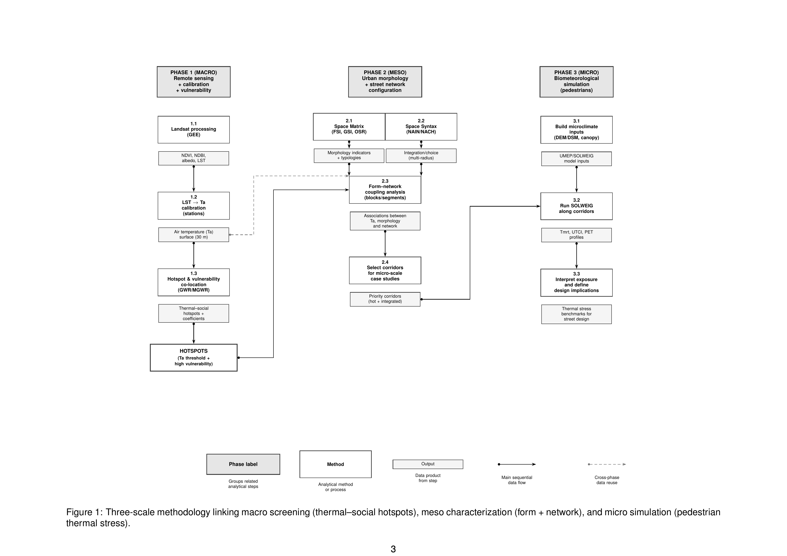
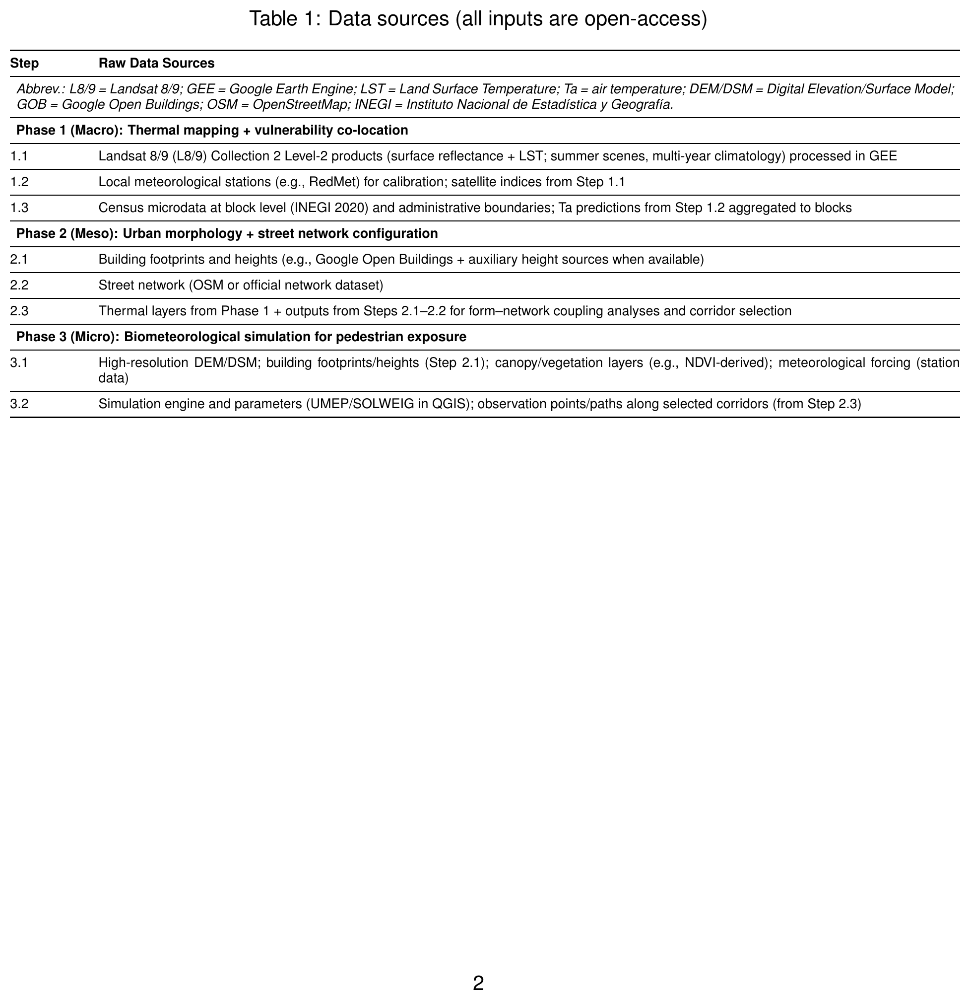
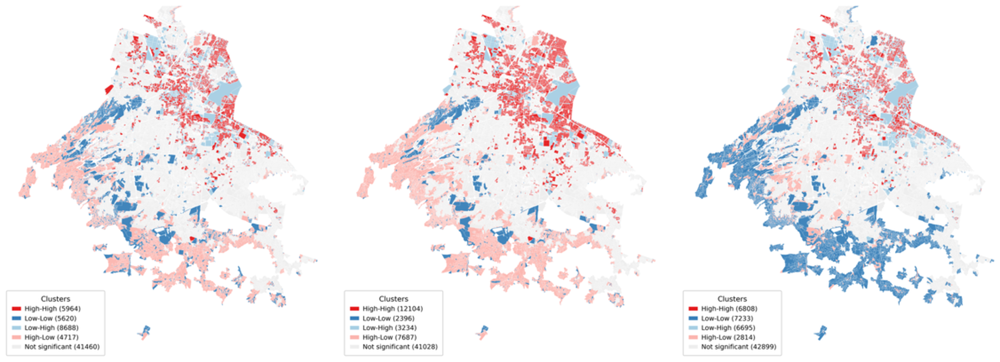
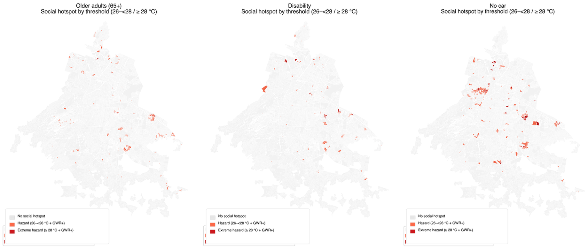

# Coupling Remote Sensing, Morphology, and Microclimate Simulation to Analyse Urban Heat in Mexico City
**MSc Dissertation** | Space Syntax: Architecture and Cities | UCL The Bartlett School of Architecture

**Author:** Daniela Resendiz Garcia | **Supervisor:** Dr. Kimon Krenz

---

## Abstract

This dissertation proposes a city-to-street analytical pipeline to assess urban heat exposure in Mexico City by coupling satellite-derived thermal surfaces, urban morphology, street-network configuration, and microclimate simulation. The study addresses three research questions across three nested spatial scales:

1. **Macro:** Where do daytime summer air temperatures co-locate with socially vulnerable populations?
2. **Meso:** Which combinations of urban form/density and network configuration characterise thermal-social hotspots?
3. **Micro:** How can micro-scale thermal stress be assessed to define passive design targets for heat reduction?

## Methodology

<p align="center">
  
</p>

| Scale | Methods | Key Outputs |
|-------|---------|-------------|
| **Macro** | Landsat 8/9 LST-to-Ta calibration (GEE), GWR by municipality | UHI air maps, thermal-social hotspots |
| **Meso** | Space Syntax (NAIN/NACH), Space Matrix (FSI/GSI/L/OSR) | Contiguous clusters of heat severity + accessibility |
| **Micro** | UMEP/SOLWEIG simulation (Tmrt, UTCI, PET) | Passive design targets for pedestrian corridors |

<p align="center">
  
</p>

## Key Results

**Thermal variables at census block level (Ta, UHI, NDVI, LST)**
<p align="center">
  
</p>

**Thermal-social hotspots (GWR)**
<p align="center">
  
</p>

Older adults, disabled residents, and households without a car are disproportionately located in hotter blocks, commonly experiencing daytime conditions 2-3 C above the citywide mean.

**Bivariate spatial analysis (LISA)**
<p align="center">
  
</p>

Bivariate Local Moran's I reveals spatial clusters where thermal exposure and social vulnerability co-locate (red = high-high), identifying priority areas for intervention.

**GWR hotspot detection by vulnerability group**
<p align="center">
  
</p>

## Key Findings

1. **Tmrt** is the most appropriate indicator of pedestrian heat stress in Mexico City
2. Thermal exposure and social vulnerability clearly overlap at sub-municipal scales
3. Two distinct spatial mechanisms identified:
   - **Structural heat** in compact, low-vegetation areas (high GSI, low OSR)
   - **Corridor heat** along highly integrated pedestrian axes (high NAIN)
4. Passive strategies (continuous shade, ventilation, cool materials) can substantially reduce outdoor heat stress

## Repository Structure

```
urban-heat-mexico-city/
├── code/
│   ├── gee/                        # Google Earth Engine (Landsat thermal)
│   ├── python/
│   │   ├── preprocessing/          # RedMet station processing
│   │   ├── macro/                  # City-wide analysis (16 scripts)
│   │   └── meso/                   # Segment/block-level analysis (8 scripts)
│   └── r/                          # Spatial regression (GWR, Moran's I)
│
├── latex/
│   ├── main/                       # Dissertation source (9 sections + references)
│   └── appendix/                   # Appendices A-F
│
├── figures/                        # Result maps and visualizations
├── data/sample/                    # Sample CSV files for reference
├── papers/                         # Conference papers
│   └── SS_Malaysia_2026_Resendiz.pdf
├── docs/diagrams/                  # Methodology diagram (TikZ source + PNG)
├── qgis/                           # QGIS style files (LST, NDVI, UHI)
├── DATA_SOURCES.md                 # Data access and download guide
└── requirements.txt                # Python dependencies
```

## Data

Large geospatial datasets (~2.8 GB) are hosted on Google Drive:

**[Download dissertation data](https://drive.google.com/drive/folders/1T4irjWUR94Gs-R9X51J4TvW7qDcZF3gD?usp=sharing)**

| Folder | Size | Contents |
|--------|------|----------|
| `manzanas/` | 428 MB | Census blocks with thermal + social + morphology |
| `street_network/` | 425 MB | Street segments with Space Syntax metrics |
| `gwr/` | 183 MB | Geographically Weighted Regression outputs |
| `thermal_rasters/` | 117 MB | Landsat thermal climatology (2014-2024) |
| `buildings/` | 1.6 GB | Filtered building footprints |

Small sample files are included in `data/sample/` for quick reference. For full details see [DATA_SOURCES.md](DATA_SOURCES.md).

## Software

- **Google Earth Engine** -- Landsat 8/9 thermal processing
- **Python 3.x** -- Spatial analysis, GWR, statistical testing (`geopandas`, `pysal`, `mgwr`)
- **R** -- Spatial regression (`sf`, `spdep`, `GWmodel`)
- **QGIS + DepthmapX** -- Space Syntax analysis, network modelling
- **UMEP/SOLWEIG** -- Microclimate simulation (Tmrt, UTCI, PET)

## Related Publications

Resendiz Garcia, D. (2026). Coupling Remote Sensing, Morphology, and Microclimate Simulation to Analyse Urban Heat in Mexico City. In *Proceedings of the 15th International Space Syntax Symposium*. Kuala Lumpur, Malaysia. [[PDF]](papers/SS_Malaysia_2026_Resendiz.pdf)

## Citation

```bibtex
@mastersthesis{resendiz2025heat,
  author  = {Resendiz Garcia, Daniela},
  title   = {Coupling Remote Sensing, Morphology, and Microclimate Simulation
             to Analyse Urban Heat in Mexico City},
  school  = {UCL The Bartlett School of Architecture},
  year    = {2025},
  url     = {https://github.com/danielaresendizg/urban-heat-mexico-city}
}
```

## License

MIT License -- see [LICENSE](LICENSE).

## Acknowledgments

Supervisor: Dr. Kimon Krenz (UCL The Bartlett). Data: Landsat 8/9 via GEE, INEGI Census 2020, SEDEMA-CDMX RedMet, Google Open Buildings, IPDP-CDMX cadastral data.
