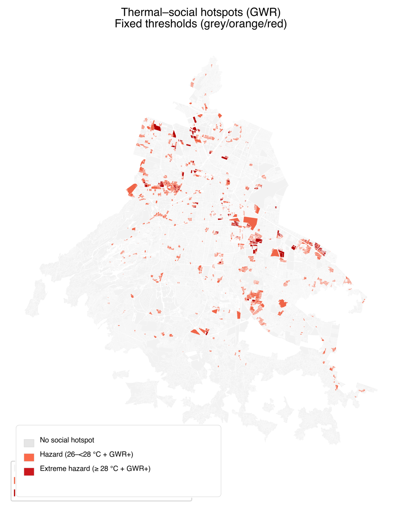
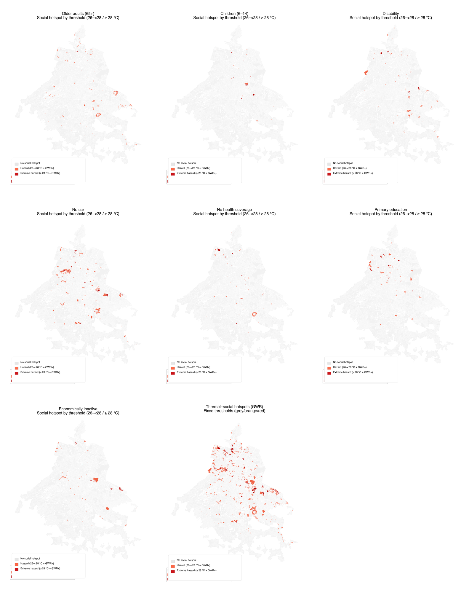

# Coupling Remote Sensing, Morphology, and Microclimate Simulation to Analyse Urban Heat in Mexico City

**MSc Dissertation** | Space Syntax: Architecture and Cities | UCL The Bartlett School of Architecture | 2024-25

**Author:** Daniela Resendiz Garcia
**Supervisor:** Dr. Kimon Krenz

---

## Abstract

This dissertation proposes a city-to-street analytical pipeline to assess urban heat exposure in Mexico City by coupling satellite-derived thermal surfaces, urban morphology, street-network configuration, and microclimate simulation. The study addresses three research questions across three nested spatial scales:

- **Q1 (Macro):** Where do daytime summer air temperatures co-locate with socially vulnerable populations?
- **Q2 (Meso):** Which combinations of urban form/density and network configuration characterise thermal-social hotspots?
- **Q3 (Micro):** How can micro-scale thermal stress be assessed to define passive design targets for heat reduction?

## Results

### Macro scale: thermal-social hotspots

<p align="center">
  
</p>

Daytime summer air temperature hotspots (26/28 °C thresholds) overlaid with social vulnerability indicators at block level, revealing strong spatial heterogeneity across municipalities.

### Macro scale: bivariate spatial analysis (LISA)

<p align="center">
  
</p>

Bivariate Local Moran's I showing spatial clusters of co-located thermal exposure and social vulnerability.

### Macro scale: social vulnerability distribution

<p align="center">
  
</p>

### GWR hotspot detection

<p align="center">
  
</p>

Geographically Weighted Regression coefficients identifying where thermal-social associations are strongest.

## Methodology

The analysis is structured across three scales:

<p align="center">
  
</p>

*Three-scale methodology linking macro screening (thermal-social hotspots), meso characterization (form + network), and micro simulation (pedestrian thermal stress). Full diagram available in [docs/diagrams/](docs/diagrams/).*

| Scale | Methods | Key Outputs |
|-------|---------|-------------|
| **Macro** | Landsat 8/9 LST-to-Ta calibration (GEE), GWR by municipality | UHI air maps, thermal-social hotspots |
| **Meso** | Space Syntax (NAIN/NACH), Space Matrix (FSI/GSI/L/OSR) | Contiguous clusters of heat severity + accessibility |
| **Micro** | UMEP/SOLWEIG simulation (Tmrt, UTCI, PET) | Passive design targets for pedestrian corridors |

### Key Data Sources

- **Thermal:** Landsat 8/9 (2014-2024 summers), RedMet weather stations (SEDEMA-CDMX)
- **Social:** 2020 Mexican Population and Housing Census (INEGI) at block level
- **Morphology:** Google Open Buildings, cadastral data (IPDP-CDMX)
- **Network:** Segmented street graph with angular centralities at 500, 1000, 1500, 5000 m

## Repository Structure

```
urban-heat-mexico-city/
├── README.md
├── LICENSE
├── requirements.txt
├── .gitignore
│
├── code/
│   ├── gee/                         # Google Earth Engine (JavaScript)
│   │   ├── README.md
│   │   └── landsat_thermal_climatology.js
│   │
│   ├── python/
│   │   ├── preprocessing/           # Data preprocessing (1 script)
│   │   │   ├── README.md
│   │   │   └── 01_process_redmet_stations.py
│   │   │
│   │   ├── macro/                   # City-wide analysis (16 scripts)
│   │   │   ├── 01_map_social_vulnerability.py
│   │   │   ├── 02_evaluate_gwr_variables.py
│   │   │   ├── 03_lisa_bivariate_social_thermal.py
│   │   │   ├── 04_map_thermal_social_hotspots.py
│   │   │   ├── 05_ols_moran_by_alcaldia.py
│   │   │   ├── 06_gwr_variable_diagnostics.py
│   │   │   ├── 07_significance_quintiles_heatmap.py
│   │   │   ├── 08_uhi_group_significance.py
│   │   │   ├── 09_granular_decile_significance.py
│   │   │   ├── 10_quintile_group_significance.py
│   │   │   ├── 11_compare_ols_gwr_performance.py
│   │   │   ├── 12_generate_social_indicators.py
│   │   │   ├── 13_temperature_distribution_plots.py
│   │   │   ├── 14_create_hotspots_gwr_thresholds.py
│   │   │   ├── 15_thermal_variable_maps.py
│   │   │   └── 16_merge_gwr_coefficients_citywide.py
│   │   │
│   │   └── meso/                    # Segment/block-level analysis (8 scripts)
│   │       ├── 01_aggregate_syntax_to_hotspots.py
│   │       ├── 02_merge_thermal_gwr_spacematrix.py
│   │       ├── 03_extract_thermal_to_segments.py
│   │       ├── 04_classify_spacematrix_typology.py
│   │       ├── 05_calculate_spacematrix_robust.py
│   │       ├── 06_calculate_spacematrix_patch.py
│   │       ├── 07_stitch_citywide_catastro.py
│   │       └── 08_prioritize_umep_study_zones.py
│   │
│   └── r/                           # R spatial regression (2 scripts)
│       ├── 01_spatial_regression_analysis.R
│       └── 02_gwr_heat_hotspot_analysis.R
│
├── data/
│   └── sample/                      # Sample data files (CSV)
│
├── docs/
│   └── diagrams/                    # Methodology flow diagrams
│       ├── methodology_flow_diagram.pdf
│       ├── methodology_flow_diagram.tex
│       ├── fig.3.png
│       ├── fig.4_meso_scale.png
│       └── fig.5_a.png
│
├── papers/                          # Conference papers & publications
│   ├── README.md
│   └── SS_Malaysia_2026_Resendiz.pdf
│
├── latex/
│   ├── main/                        # Main dissertation (9 files + references.bib)
│   └── appendix/                    # Appendices A-F (7 files)
│
├── figures/                         # Key result figures
│
└── qgis/                            # QGIS style files (LST, NDVI, UHI)
```

## Workflow Overview

The analysis follows a **three-phase pipeline**:

### Phase 1: Data Preprocessing
- **RedMet station processing** (`code/python/preprocessing/`)
  - Process historical weather data (2014-2024)
  - Generate LST→Ta calibration coefficients
  - **Data access:** [Google Drive - RedMet Historical Files](YOUR_GOOGLE_DRIVE_LINK_HERE)

### Phase 2: Macro/Meso Analysis
- **Google Earth Engine** (`code/gee/`) - Landsat thermal mapping
- **Python scripts** (`code/python/macro/`, `code/python/meso/`)
  - Thermal-social hotspot detection
  - Space Syntax + Space Matrix integration
- **R scripts** (`code/r/`) - Spatial regression (GWR, Moran's I)

### Phase 3: Micro-scale Simulation
- **UMEP/SOLWEIG** (QGIS plugin) - Pedestrian thermal stress
- Results visualized in dissertation figures

## Software and Tools

- **Google Earth Engine** - Satellite imagery processing and thermal mapping
- **Python 3.x** - Spatial analysis, GWR, statistical testing
  - `geopandas`, `pysal`, `mgwr`, `matplotlib`, `numpy`, `scipy`
- **R** - Spatial regression (OLS, GWR, Moran's I)
  - `sf`, `spdep`, `spatialreg`, `GWmodel`
- **QGIS + DepthmapX** - Space Syntax analysis, network modelling
- **UMEP/SOLWEIG** - Microclimate simulation (Tmrt, UTCI, PET)
- **LaTeX** - Document preparation

## Key Findings

1. **Tmrt** is the most appropriate indicator of pedestrian heat stress in Mexico City
2. Thermal exposure and social vulnerability clearly overlap at sub-municipal scales
3. Two distinct spatial mechanisms were identified:
   - **Structural heat** in compact, low-vegetation areas (high GSI, low OSR)
   - **Corridor heat** along highly integrated pedestrian axes (high NAIN)
4. Passive strategies (continuous shade, ventilation, cool non-glare materials) can substantially reduce outdoor heat stress

## Citation

If you use this work, please cite:

```
Resendiz Garcia, D. (2025). Coupling Remote Sensing, Morphology, and Microclimate Simulation
to Analyse Urban Heat in Mexico City, Mexico. MSc Dissertation, UCL The Bartlett School of
Architecture.
```

## Related Publications

- **Resendiz Garcia, D.** (2026). Coupling Remote Sensing, Morphology, and Microclimate Simulation to Analyse Urban Heat in Mexico City. In *Proceedings of the 15th International Space Syntax Symposium*. Kuala Lumpur, Malaysia. [[PDF](papers/SS_Malaysia_2026_Resendiz.pdf)]

## License

This project is licensed under the MIT License - see the [LICENSE](LICENSE) file for details.

## Contact

Daniela Resendiz Garcia - [GitHub](https://github.com/danielaresendizg)
